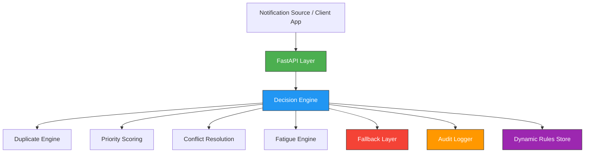

# 🔔 Notification Prioritization Engine  
### 🚀 Cyepro AI – Round 1 Solution  
**Author:** Anusha V  

---

## 🌟 Overview

Modern applications generate massive volumes of notifications — messages, alerts, reminders, promotions, system updates, and more.  

Without intelligent prioritization, users experience:

- 🔁 Duplicate notifications  
- 🔕 Alert fatigue  
- ⏰ Poor timing  
- ❗ Missed critical alerts  

This project implements an **AI-native Notification Prioritization Engine** that decides for every incoming event:

> ✅ **Now** – Send immediately  
> ⏳ **Later** – Defer or schedule  
> ❌ **Never** – Suppress  

The system is modular, explainable, configurable, and designed with scalability in mind.

---

# 🏗 System Architecture

## 🔹 Core Components

### 1️⃣ API Layer (FastAPI)
- Accepts incoming notification events
- Exposes rule configuration endpoint
- Exposes audit log endpoint
- Provides interactive Swagger UI

---

### 2️⃣ Decision Engine
- Computes priority score
- Applies conflict resolution
- Handles priority overrides
- Produces explainable outcomes

---

### 3️⃣ Duplicate Engine
- 🔐 Hash-based exact duplicate detection
- 🧠 Similarity-based near-duplicate detection
- 🎛 Configurable similarity threshold
- 👤 Per-user message tracking

---

### 4️⃣ Fatigue Engine
- Limits notifications per user
- Configurable time window
- Prevents alert overload
- Supports high-priority override

---

### 5️⃣ Dynamic Rule Store
- Runtime-updatable configuration
- No code redeployment required
- API-driven rule updates

---

### 6️⃣ Audit Logger
Stores:
- user_id  
- event_type  
- message  
- decision  
- priority score  
- explanation  
- timestamp  

Ensures full traceability and explainability.

---

### 7️⃣ Fallback Layer
If the decision engine fails:
- System defaults to **safe "Later"**
- Prevents silent loss of notifications
- Maintains system reliability

---

# 🔁 Data Flow
```
Incoming Notification Event
        ↓
Duplicate Check
        ↓
Priority Scoring
        ↓
High Priority Override
        ↓
Fatigue Check
        ↓
Final Decision (Now / Later / Never)
        ↓
Audit Logging
        ↓
    Response
```

---

# 🧠 Decision Strategy

| Condition | Decision |
|------------|----------|
| Expired notification | ❌ Never |
| Exact / Near duplicate | ❌ Never |
| High priority (score ≥ 70) | ✅ Now |
| Fatigue threshold exceeded | ⏳ Later |
| Medium / Low priority | ⏳ Later |

⚡ High-priority alerts override fatigue to avoid missing critical events.

---

# ⚙️ Dynamic Rule Configuration

Rules can be updated at runtime:

### 📌 Endpoint

POST /update-rules

### 🧾 Example Request
```
{
  "FATIGUE_LIMIT": 3,
  "DUPLICATE_THRESHOLD": 0.98
}
```

---

## ⚙️ Dynamic Rule Configuration

✔ No server restart required  
✔ No redeployment required  

This satisfies the requirement:

> Support human-configurable rules without full code deployment.

---

## 📊 API Endpoints
```
| Endpoint        | Method | Description                              |
|-----------------|--------|------------------------------------------|
| `/notify`       | POST   | Process notification event               |
| `/logs`         | GET    | Retrieve audit logs                      |
| `/update-rules` | POST   | Update system rules dynamically          |
| `/`             | GET    | Health check                             |
```
---

## 🔔 Duplicate Prevention Strategy

- Uses **MD5 hashing** for exact duplicate detection  
- Uses **SequenceMatcher similarity** for near-duplicate detection  
- Configurable similarity threshold  
- Per-user memory store  

Prevents notification spam even when message text slightly changes.

---

## 🔕 Alert Fatigue Strategy

- Maximum notifications per user within a configurable window  
- Tracks recent activity per user  
- High-priority alerts bypass fatigue  

Reduces user overload without blocking critical alerts.

---

## 📈 Explainability & Auditability

Each decision includes:

- Decision type  
- Priority score  
- Clear explanation  
- Timestamp  

### 📌 Example Log Entry

```json
{
  "user_id": "U123",
  "event_type": "security_alert",
  "decision": "Now",
  "score": 90,
  "explanation": "High priority override 90",
  "timestamp": "2026-02-26T18:30:21"
}
```

This ensures complete traceability and transparency.

---

## 🧯 Fallback Strategy

If the AI/decision logic fails:

- System safely defaults to **Later**
- Prevents silent dropping of important notifications
- Maintains reliability under failure conditions

---

## 🚀 Scalability Considerations

To handle thousands of events per minute:

- Replace in-memory storage with Redis  
- Use asynchronous FastAPI  
- Integrate Kafka / message queues  
- Persist logs to a database  
- Add rate-limiting middleware  
- Deploy as containerized microservice  

---

## 🏁 How To Run

```bash
python -m venv venv
venv\Scripts\activate
pip install fastapi uvicorn
uvicorn app:app --reload
```

Open:

```
http://127.0.0.1:8000/docs
```

---

## 🏆 Why This Solution Stands Out

✔ Modular microservice design  
✔ Duplicate & near-duplicate prevention  
✔ Alert fatigue control  
✔ Conflict resolution handling  
✔ Runtime rule configuration  
✔ Explainable decisions  
✔ Safe fallback mechanism  
✔ Scalable architecture thinking  

This is not just a coding solution — it demonstrates backend system design thinking.

---

## 🔮 Future Enhancements

- ML-based adaptive priority scoring  
- User behavior learning  
- Persistent distributed cache  
- Real-time monitoring dashboard  
- Multi-channel delivery optimization  

---

## 🎯 Conclusion

This Notification Prioritization Engine demonstrates:

- Practical system design  
- AI-native decision thinking  
- Reliability-first architecture  
- Production-ready extensibility  

Built with scalability, configurability, and explainability in mind.

---
<<<<<<< HEAD


## 🏗 Architecture Diagram


**Figure:** High-level architecture of the Notification Prioritization Engine showing decision orchestration, duplicate handling, fatigue management, dynamic rule configuration, audit logging, and fallback safety.
=======
>>>>>>> ccf25b0ae65399cd0ddc077fb1f0ae2eacc98a91
